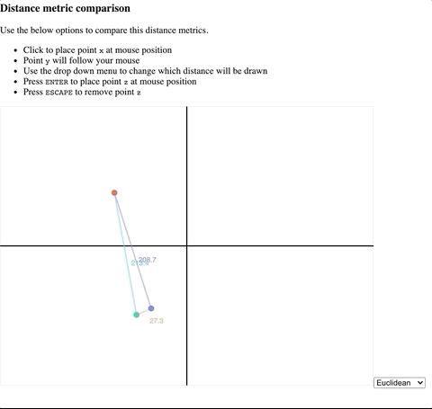

# Distance Metrics

Small demo app to comapre some distance metrics.  App is live at [https://adamspannbauer.github.io/distance_metrics_demo/](https://adamspannbauer.github.io/distance_metrics_demo/)

  

## Disclaimer

This is a quick and dirty app.  If you're here to learn.  Don't do it by reviewing my code (unless its to point out whats wrong and open a PR to make it better).

## Contributing

If you'd like to add a distance metric be my guest!  I'll happily review and accept any PRs that will add some value.  See disclaimer section before considering contributing.
